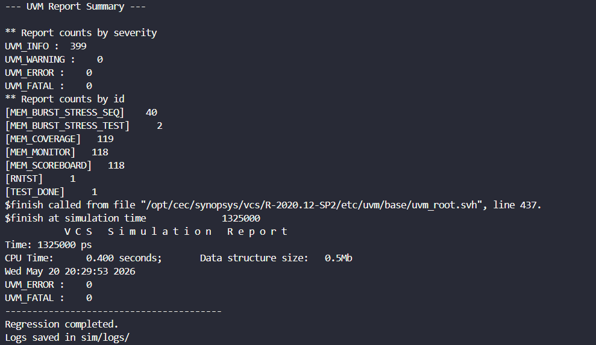
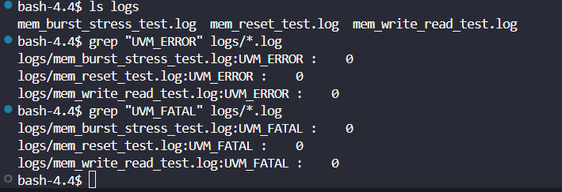

# DDR-Like Memory Controller Verification

## Project Overview

This project verifies a simplified DDR-like memory controller using SystemVerilog and UVM. The design supports single and burst read/write transactions, bank-based memory access, ready/valid handshaking, reset handling, and multi-cycle burst transfers.

This is not a full DDR3/DDR4/DDR5 JEDEC protocol implementation. It is a DDR-like memory controller verification project focused on industry-style ASIC design verification concepts.

## Key Features

- Configurable memory controller RTL
- Single read and write transactions
- Burst write across consecutive addresses
- Burst read across consecutive addresses
- Multi-cycle burst transfer using `burst_len`
- Bank-based memory access
- Ready/valid handshake
- Reset stress testing
- Back-to-back burst transaction testing
- Scoreboard-based data integrity checking
- Functional coverage collection
- SystemVerilog assertions
- Regression script with log generation

## Design Interface

| Signal | Description |
|---|---|
| `clk` | Clock |
| `rst_n` | Active-low reset |
| `valid` | Request valid |
| `ready` | Controller ready |
| `write_en` | Write enable: 1 = write, 0 = read |
| `addr` | Memory address |
| `wdata` | Write data |
| `rdata` | Read data |
| `rvalid` | Read data valid |
| `bank` | Memory bank select |
| `burst_len` | Burst length field |

## Burst Behavior

The controller supports burst transactions using `burst_len`:

| burst_len | Number of Beats |
|---|---|
| 0 | 1 beat |
| 1 | 2 beats |
| 2 | 3 beats |
| 3 | 4 beats |

For example, a burst write with:

```text
addr = 0x10
burst_len = 3
```

writes to:

```text
0x10, 0x11, 0x12, 0x13
```

## UVM Testbench Architecture

```text
mem_base_test
   └── mem_env
        ├── mem_agent
        │    ├── mem_sequencer
        │    ├── mem_driver
        │    └── mem_monitor
        ├── mem_scoreboard
        └── mem_coverage
```

## Verification Components

### Sequence Item

Defines memory transaction fields such as:

- `write_en`
- `addr`
- `wdata`
- `rdata`
- `bank`
- `burst_len`

### Driver

Drives transaction-level requests onto the DUT interface using ready/valid handshaking.

### Monitor

Captures read/write transactions from the DUT interface, including multi-beat burst transfers.

### Scoreboard

Maintains a reference memory model and checks read data against expected write data.

### Functional Coverage

Tracks coverage for:

- Read/write transactions
- Bank selection
- Burst length
- Address range
- Read/write and bank cross coverage

### Assertions

SystemVerilog assertions check protocol behavior such as:

- No unknown `valid`
- No unknown `ready`
- No `rvalid` during reset
- Address known during valid transaction
- Bank known during valid transaction
- Read transaction produces `rvalid`

## Test Cases

| Test Name | Description |
|---|---|
| `mem_write_read_test` | Directed randomized write-read verification |
| `mem_reset_test` | Reset stress test with scoreboard synchronization |
| `mem_burst_stress_test` | Back-to-back burst read/write stress test |

## Regression

Run a single test:

```bash
cd sim
./run.sh mem_write_read_test
./run.sh mem_reset_test
./run.sh mem_burst_stress_test
```

Run full regression:

```bash
cd sim
./regress.sh
```

Expected result:

```text
UVM_ERROR : 0
UVM_FATAL : 0
```

Regression logs are saved in:

```text
sim/logs/
```

Regression Results + Screenshots:

UVM_Report_Summary:



Regression_logs:



## Project Structure

```text
ddr_like_mem_ctrl_uvm/
├── README.md
├── docs/
│   └── memory_controller_spec.md
├── rtl/
│   └── ddr_like_mem_ctrl.sv
├── sim/
│   ├── run.sh
│   └── regress.sh
├── tb/
│   ├── mem_pkg.sv
│   ├── top_tb.sv
│   ├── interfaces/
│   │   └── mem_if.sv
│   ├── agent/
│   │   ├── mem_seq_item.sv
│   │   ├── mem_sequencer.sv
│   │   ├── mem_driver.sv
│   │   ├── mem_monitor.sv
│   │   └── mem_agent.sv
│   ├── env/
│   │   ├── mem_env.sv
│   │   ├── mem_scoreboard.sv
│   │   └── mem_coverage.sv
│   ├── sequences/
│   │   ├── mem_basic_seq.sv
│   │   ├── mem_write_read_seq.sv
│   │   ├── mem_reset_seq.sv
│   │   └── mem_burst_stress_seq.sv
│   └── tests/
│       ├── mem_base_test.sv
│       ├── mem_write_read_test.sv
│       ├── mem_reset_test.sv
│       └── mem_burst_stress_test.sv
```

## Tools Used

- SystemVerilog
- UVM
- Synopsys VCS
- Linux shell scripting
- VS Code

## Key Verification Results

- Verified randomized read/write transactions
- Verified burst read/write transfers across consecutive addresses
- Verified multi-cycle burst behavior using `burst_len`
- Verified reset recovery behavior
- Verified back-to-back burst stress scenarios
- Achieved clean regression with 0 UVM errors and 0 UVM fatal errors
- Debugged and fixed scoreboard synchronization during reset
- Debugged and fixed burst address boundary overflow through constrained stimulus
